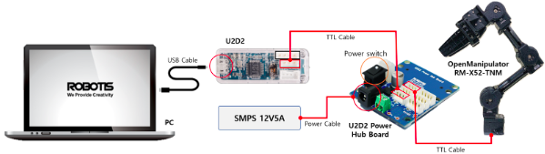
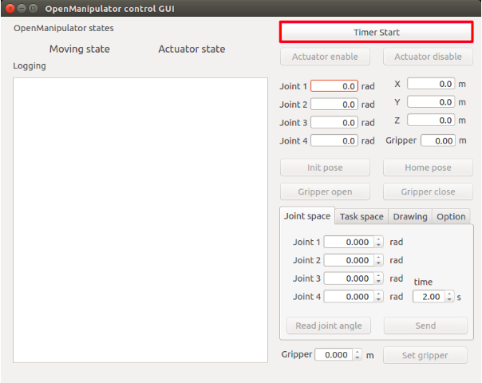
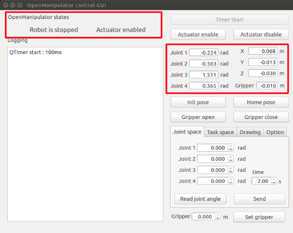
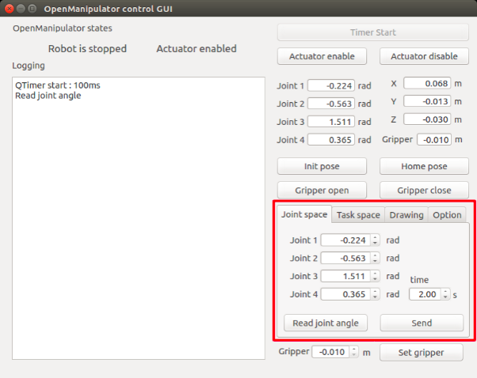
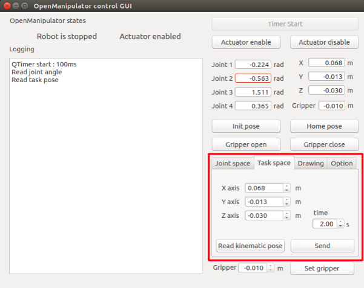

# 実機での操作
このページは以下のRobotis社e-manualにベースに作成したものです．
https://emanual.robotis.com/docs/en/platform/openmanipulator_x/overview/

## ロボットを動かす準備
本実験ではOpenMANIPULATOR-XのコントローラとしてU2D2 (デバイス名：ttyUSB）を使います．まず，U2D2とPCをUSBケーブルで接続しましょう．次に，U2D2 Power Hub BoardにACアダプタを接続して，Power switch（電源スイッチ）を入れる．ノートPCに配布されたUSBを差し込む．このUSBで起動すると実験の設定済みのOSであるUbuntuが起動する．



本実験では，Windowsは使わず，Ubuntuを使う．ログイン時にユーザ名とパスワードを聞かれるので以下を入力する．なお，パスワードを入力しても何も見えが気にせず入力してからEnterキーを押す．
```
ユーザ名: kit
パスワード:  ILoveKIT
```
ctrl, alt, tを同時に押して端末を開いて，次のlsコマンドを入力してttyUSB0というファイルがあるか確認する．先頭の$はプロンプト（コマンド入力の目印）なので打ち込まない．lsコマンドはファイルを表示するコマンド．ttyUSB0が表示されていれば，U2D2がコンピュータに認識されている．なければ認識されていないので，U2D2とコンピュータとの接続とU2D2 Power Hub Boardの電源が入っているか確認する．
```
$ ls /dev
```
ユーザがデバイスを使えるように，chmodコマンドでファイルのパーミッション（権限）を変更する．777は全てのユーザに読み，書き，実行権を与える意味．
```
$ sudo chmod 777 /dev/ttyUSB0
```

## GUIプログラムでロボットを動かそう
まず，GUIプログラムでロボットを動かしてみよう！OpenMANIPULATOR-X コントローラの起動．上の説明で既に実行している場合は不要．
```
$ sudo chmod 777 /dev/ttyUSB0
```
```
$ roslaunch open_manipulator_controller open_manipulator_controller.launch
```
GUI プログラムの起動．別の端末を開き，次のコマンドを実行する．
```
$ roslaunch open_manipulator_control_gui open_manipulator_control_gui.launch
```
下図のウインドウが開くので右上の Timer Start ボタンをクリックする．

OpenMANIPULATOR-Xの状態をチェックしよう.

OpenMANIPULATOR-X をジョイント(関節)空間で動かす場合は， 関節角と軌道時間を入力しから， send ボタンをクリックする．

OpenMANIPULATOR-X をタスク空間で動かすためには，X, Y, Z各軸の値と軌道時間を入力してから， send ボタンをクリックする．
