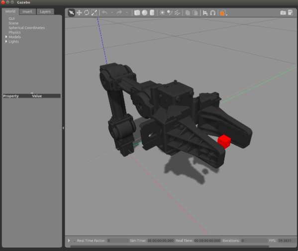

# シミュレータでの操作
このページの説明は以下のサイトを参考に作成したものです．
https://emanual.robotis.com/docs/en/platform/openmanipulator_x/ros_simulation/
## Gazeboの起動
Ubuntu端末を開き，次のコマンドを入力して OpenManipulator-X のGazeboシミュレータを起動する．Gazeboウインドウが開いたら左下の Play ▶ ボタンをクリックする．
```
$ roslaunch open_manipulator_gazebo open_manipulator_gazebo.launch
```
下図の赤い立方体は，エンドエフェクタのリンクを示している．



シミュレータ実行中の有効なトピック（データの名前）は次のコマンドで表示できます．端末を開いて実行してみましょう．**これより少なくても問題ありません**．
```
$ rostopic list
```
```
/clock
/gazebo/link_states
/gazebo/model_states
/gazebo/parameter_descriptions
/gazebo/parameter_updates
/gazebo/set_link_state
/gazebo/set_model_state
/gazebo_gui/parameter_descriptions
/gazebo_gui/parameter_updates
/gazebo_ros_control/pid_gains/gripper/parameter_descriptions
/gazebo_ros_control/pid_gains/gripper/parameter_updates
/gazebo_ros_control/pid_gains/gripper/state
/gazebo_ros_control/pid_gains/gripper_sub/parameter_descriptions
/gazebo_ros_control/pid_gains/gripper_sub/parameter_updates
/gazebo_ros_control/pid_gains/gripper_sub/state
/gazebo_ros_control/pid_gains/joint1/parameter_descriptions
/gazebo_ros_control/pid_gains/joint1/parameter_updates
/gazebo_ros_control/pid_gains/joint1/state
/gazebo_ros_control/pid_gains/joint2/parameter_descriptions
/gazebo_ros_control/pid_gains/joint2/parameter_updates
/gazebo_ros_control/pid_gains/joint2/state
/gazebo_ros_control/pid_gains/joint3/parameter_descriptions
/gazebo_ros_control/pid_gains/joint3/parameter_updates
/gazebo_ros_control/pid_gains/joint3/state
/gazebo_ros_control/pid_gains/joint4/parameter_descriptions
/gazebo_ros_control/pid_gains/joint4/parameter_updates
/gazebo_ros_control/pid_gains/joint4/state
/open_manipulator/gripper_position/command
/open_manipulator/gripper_sub_position/command
/open_manipulator/joint1_position/command
/open_manipulator/joint2_position/command
/open_manipulator/joint3_position/command
/open_manipulator/joint4_position/command
/open_manipulator/joint_states
/rosout
/rosout_agg
```

## Gazeboの制御
Gazeboシミュレータ用の open_manipulator_controller を起動しましょう．シミュレータ環境でコントローラを実行するためには，次のコマンドの use_platform パラメータを false に設定しなければなりません．falseに設定しないとシミュレータではなく実機のコントローラが起動します．
```
$ roslaunch open_manipulator_controller open_manipulator_controller.launch use_platform:=false
```
注: MoveIt!で GazeboのOpenMANIPULATOR-X を制御したいときは，open_manipulator_controller のlauchファイルの use_moveit パラメータを false  から true にしなければならない．

OpenMANIPULATOR-X コントローラが正常に起動されたら，端末に次のメッセージが表示される．
```
SUMMARY
========

PARAMETERS
 * /open_manipulator/control_period: 0.01
 * /open_manipulator/moveit_sample_duration: 0.05
 * /open_manipulator/planning_group_name: arm
 * /open_manipulator/using_moveit: False
 * /open_manipulator/using_platform: False
 * /rosdistro: kinetic
 * /rosversion: 1.12.14

NODES
  /
    open_manipulator (open_manipulator_controller/open_manipulator_controller)

ROS_MASTER_URI=http://localhost:11311

process[open_manipulator-1]: started with pid [9820]
[ INFO] [1544506914.862653563]: Ready to simulate /open_manipulator on Gazebo
```

## Gazeboの操作
Gazeboで操作するためには，OpenMANIPULATOR-XのGUI操作プログラムかキーボード操作プログラムを起動する．やり方は実機と同じ．
